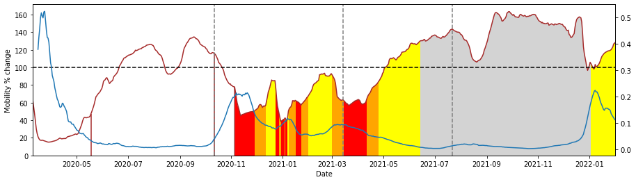

# Mobility effect on the spread of COVID-19 epidemics and restrictions efficacy on mobility

    

## Authors

* [**Lipani Samuele**](https://github.com/samuelelipani) (University of Padua)
* [**Rinaldi Luca**](https://github.com/RinaldiLuca) (University of Padua)

## Abstract
The project is intended to study the correlation between the human mobility and the evolution of the epidemic, 
trying to divide the data in time windows in order to make them as homogeneous as possible.

In the second part we aim to study the real effectiveness of the restrictions on the human mobility, and eventually infer the time after which the the restriction became effective.

## Content
* [**`DATA`**](https://github.com/RinaldiLuca/Mobility_in_Covid19_Pandemic/tree/main/DATA) folder contains all the data analyzed in this study. - ***still need to be updated and properly arranged***
* [**`code`**](https://github.com/RinaldiLuca/Mobility_in_Covid19_Pandemic/tree/main/code) folder contains the notebooks for the various analysis. - ***still need to be updated and properly arranged***

The final presentation of this project can be found [**here**](https://github.com/RinaldiLuca/Mobility_in_Covid19_Pandemic/tree/main/presentation.pdf)
